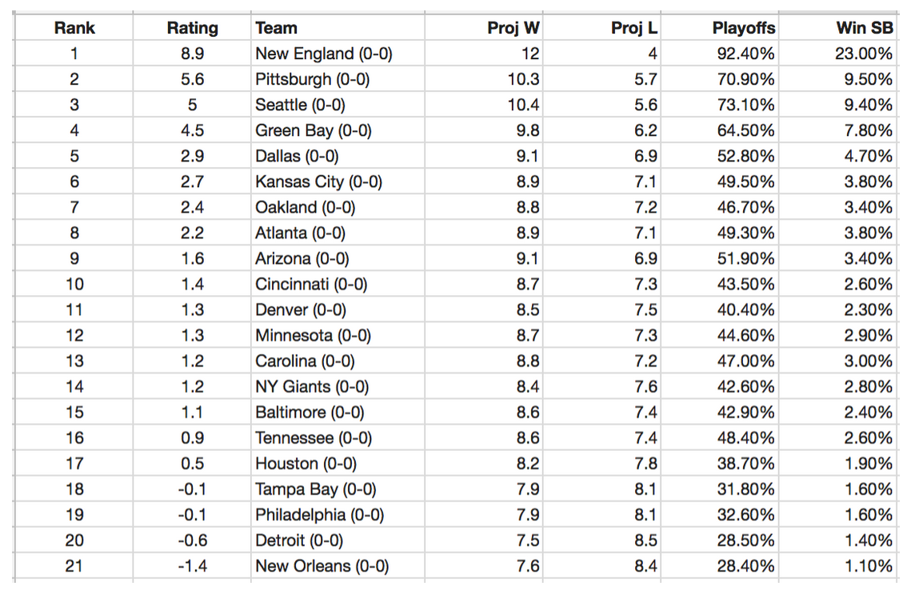

# Example 1: Sports Data in Excel

NFL Team Projected Rankings

The following is a header of NFL team rankings according to [TeamRankings](https://www.teamrankings.com/ncf/stats/) shown in a spreadsheet application. Spreadsheets will be a part of your first major project. For now, see if you can understand the basics of the data being stored here.

Again, there is nothing to turn in from this part of the project, but shows one application of spreadsheets.

Spreadsheets are used to store, analyze, and present data for a number of industries. An example of what data stored in a spreadsheet might look like is shown below. 

1. Next to each Team you can see the team record. Who has the best record?

[ ] Arizona
[ ] Minnesota
[ ] Minnesota
[ ] Detroit
[ ] None of the Above

**Solution:**:  None of the Above 

2. Find the team beside the appropriate data describing the team.

| Data | Team |
|------|------|
| Projected 12 Wins| |
| Playoff Win % of 49.5% | | 
| Rank 13| |
| 0-0 Record| |

**Solution:**

| Data | Team |
|------|------|
| Projected 12 Wins| New England |
| Playoff Win % of 49.5% | Kansas City | 
| Rank 13| Carolina |
| 0-0 Record| All of them. |

