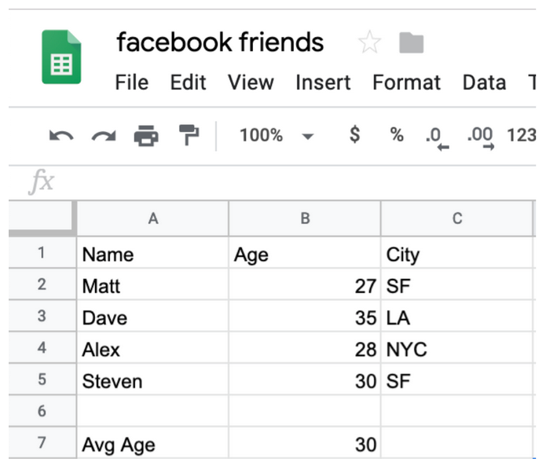
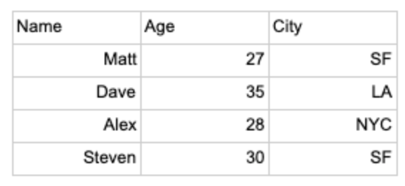
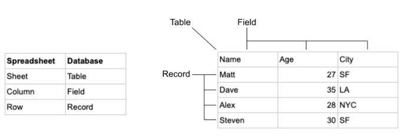
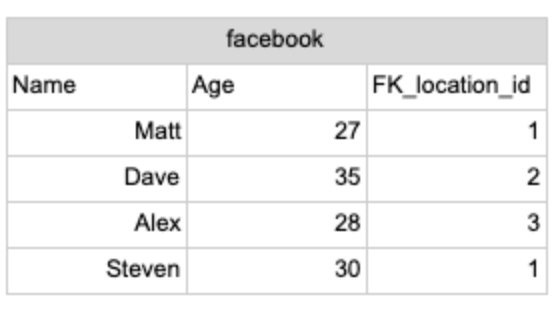
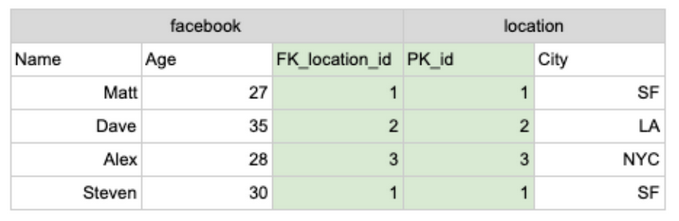
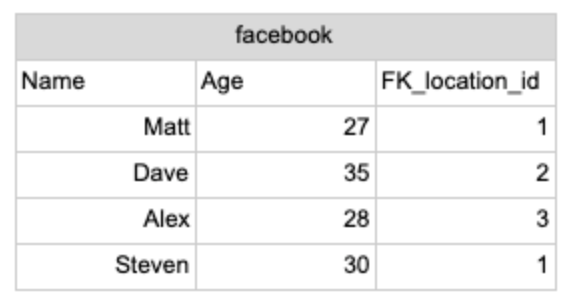
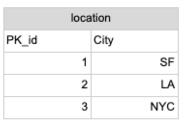
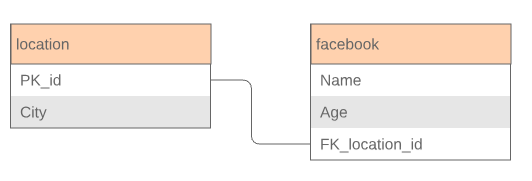
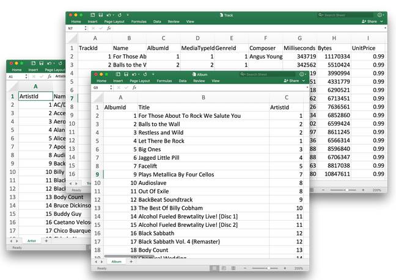

# Quick Introductory SQL Concepts

There are hundreds of SQL tutorials online to teach people SQL syntax. This section is not about syntax. This section is about building mental models around what SQL is doing.

The main sticking points:

    Confusion about what a database is
    How Joins work
    How Aggregations work
    How Subqueries work
    What to do about errors
    How to approach optimization

Understanding these abstract ideas comes naturally to engineers and analysts who work with code everyday. Business people tend to struggle with understanding what code is doing. They can’t quite conceptualize how the data is being transformed. They only see input and output.

This section will provide many graphics, animations, and explanations to help convey SQL to others.

This interactive SQL tutorial is designed to get you querying as quickly as possible.

## Why Databases?

What is a database and why use one

People understand a spreadsheet. It is visual, the data is right there, and you can perform calculations right next to the data. For many scenarios this is the right tool to use.

The scenario we will be exploring is managing the data within a business. There are big disadvantages to using spreadsheets to do this, which databases handle very well.

- Size
- Accuracy
- Security

### Size

Spreadsheets typically top out a million rows of data. Databases can store practically and unlimited number of rows of data. Spreadsheets can have multiple sheets which can allow for complex calculations between multiple sets of data, but these become difficult to manage visually. Databases again can practically support unlimited number of tables and make working with all that data much more simple through SQL queries.

### Accuracy

Keeping data accurate is very difficult. Imagine updating the following sheet:

Now Imagine if the city of San Francisco (SF) made the horrible choice to officially change it’s name to Frisco (F). Now while we might disagree with this decision when we go to update the spreadsheet we have to update the value in multiple places. This creates an opportunity for error. Perhaps we missed one.

In a spreadsheet we could do ctrl F or use the Find and Replace but this might break down if data is spread across multiple sheets, it would be easy to miss one. In databases using SQL and 3rd Normal Form(more on this later) we can make these updates easily and accurately.

### Security

Spreadsheets have a binary level of access, either you have the file or link or you do not. Databases allow for complex permission settings to not only prevent certain people from being able to see certain parts of the data, but also to encrypt data within the database. This allows for compliance with regulations like GDPR and also protects the data from being edited by the wrong people.

## Why using a database can be challenging

To access the data within a database you will need to use SQL. While this is a fairly simplistic programming language it is not as intuitive as using a spreadsheet. There is a learning curve here.

Another pain point with working with data in a database is getting access. In many companies the amount of people who can run queries is fairly limited. Typically you will need to request access from the data team or your IT group.

Data is structured differently than in a spreadsheet. It is stored in what’s called 3rd Normal Form. This means that the data you want is typically spread out across multiple tables which you will need to join together.

## Basic database vocabulary

New jargon always takes time to sink in. These words will be used throughout the book and will help make conversations about data more clear.

- Table
- Field
- Record
- Primary Key
- Foreign Key
- Schema

Table, Field and Record all mean something very similar to common spreadsheet words. Their pairs are as follows:

Primary Key and Foreign Key are database specific concepts. Data in a database is spread out across multiple tables we need ways of bringing all that data back together. This is accomplished by using Primary and Foreign Keys. The Primary Key is the ID field in a table, that uniquely identifies each record.

The primary key is indicated here with PK_id:

Then in another table the primary key for the location table might exist as well, this is called a Foreign Key.

The Foreign Key is indicated here as FK_location_id:

Now we can join these two tables together using the Primary and Foreign Keys to make one big table:

If we zoom out to see these two tables in the same database before they were joined we can explain the last jargon word, Schema. Schema is the word to describe all of the tables that exist within the database:

These tables in a schema are commonly represented by showing the table name at the top with all of the field names listed below:

## Data types

Ok there is actually more new jargon and these require special attention since most of the errors in writing SQL statements will be related to data type issues. Data types specify what sort of data is stored and what sort of functions can be called on. Every field in a database has a data type associated with it.

1. VARCHAR: Character string having variable length
   1. This data type treats everything as text, you can place numbers in here but adding them together would just attach them which is what you would expect with text.
   2. a + b = ab
   3. 1 + 2 = 12
2. INTEGER: Whole Numbers
   1. This data type only allows whole numbers inside of it. All math functions can be applied to it. Text cannot be placed inside of it
   2. 1 + 2 = 3
3. FLOAT: Numbers with decimal point values
   1. This data type works the same as INTEGER but allows decimal values
   2. 1.1 + 2.2 = 3.3
4. BOOLEAN: True or False value
   1. This data type can either be True or False. It is useful for setting binary characteristics or status about some data.
   2. Is the house on fire? True or False?
5. DATE: Date/Time value
   1. This data type contains date or time information which allows you to perform calculations relevant to date time information.
   2. How many days are between 1/1/19 and 2/4/19? 34

There is one data type that is not defined for fields that can show up in any of these.

1. NULL: This means there is no value in the cell
   1. This data type is useful for showing the absence of data. A blank cell and a Null cell are different. Null is ignored by aggregations and it is easy to filter for. Blank values or 0s would be included in aggregations and can be more difficult to detect
   2. What is the Average of 1 + Null + 5? 3
   3. What is the Average of 1 + 0 + 5? 2

## Summary

1. Databases are used to accommodate a lot of data, make updating easy and accurate, and allowing for more security
2. Databases are challenging to work with due to SQL, permissions, and 3rd Normal Form
3. Databases are very similar to having multiple spreadsheets but the jargon is slightly different
4. There are specific data types for each field in a database

## SQL

SQL might seem intimidating but it’s really fairly easy to understand. SQL stands for Structured Query Language and simply put, it’s a search language for you to instruct a database about what information you’d like retrieved from it.

Just think of it as an advanced, really structured google search. For example in Google you might ask something like

Google Example Question

And in SQL, if you had a database with that information in it, the equivalent question might be answered with something like

SELECT age FROM presidents WHERE name = 'Barack Obama';

Don’t worry about understanding the above query yet, you’ll get that in no time.

## Tables - for those familiar with Excel

Databases organize data in different tables. I’m assuming that most people reading this are familiar with Excel or some other Spreadsheet software. This makes it easier to explain what a table is as a Table is basically just a Spreadsheet of data. It has columns with names of fields, and then rows holding the actual data.

In this tutorial we’ll be using an example data set that has a bunch of information on tracks, albums and artists in a music collection. Most databases architects will typically split those items into their own tables rather than group them all in one. You’ll learn all about linking them together when we get to the section on Table Relationships and JOINs.

