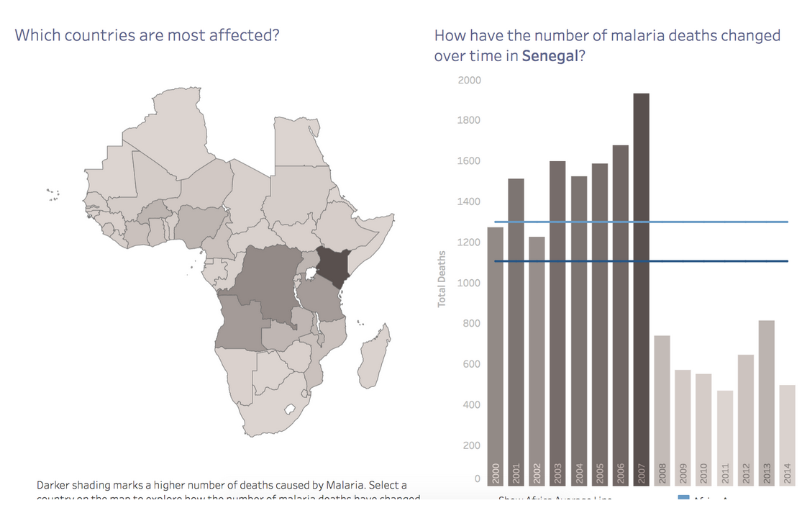

# Project 1: Introduction

A large part of working with data is being able to interpret data visualizations and explain your insights to others. To give you some practice with this, we’ve selected a few Tableau dashboards for you to explore. The links are below, under "Choose from these Dashboards." Choose one of these dashboards, whichever one interests you the most, and find three insights in the visualizations. For each insight, provide a static image that shares what you found. Write a short report explaining each observation and how you found the information to reach your conclusion from the dashboard. Altogether (including images), your report should be 1-2 pages.

[Dashboard 1](https://public.tableau.com/en-us/s/gallery/madrid-details?gallery=featured): Population characteristics of the city of Madrid. It is interactive dashboard. You can gain information about each part of the city in terms of birth, death and additional info.

[Dashboard 2](https://public.tableau.com/en-us/s/gallery/malaria-africa?gallery=featured): Impact of malaria in Africa year over year. It allows you to see trends and number of deaths in each region.

[Dashboard 3](https://public.tableau.com/profile/matt.chambers#!/vizhome/LinkedInTopSkills2016-MakeoverMonday/LinkedInTopSkills2016-MakeoverMonday): Top skills according to LinkedIn in 2016 in each country. These skills are also ranked globally, where 1 is considered to be best ranking.

# Example

For example one insight might look like:

“Deaths per year due to malaria in Senegal have been halved since 2007. From that dashboard, I clicked on Senegal on the map, this showed deaths due to malaria for each year from 2000 to 2014. Before 2007, there were about 1400-1500 deaths per year. After 2007, starting in 2008, deaths were reduced to about 600-700 per year.”

> If you choose to work with the LinkedIn data, you may find [this article](https://blog.linkedin.com/2016/10/20/top-skills-2016-week-of-learning-linkedin) helpful for the insights that you draw.

# Project Submission

## Completeness

|Criteria| 	Meet Specification|
|----|----|
Required number of insights|Three insights are reported.
Insight explanations|Each insight has an explanation describing how the insight was reached from the data. For each insight, provide a screenshot that shows what you found in the dashboard.

## Correctness

|Criteria |	Meet Specification |
|------|-----|
Correct conclusions|Student’s conclusions are correct based on the data.
Correct usage|The dashboard was used appropriately to find the information.

> Submit the doc/ppt/pdf to xxxx