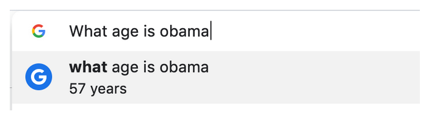
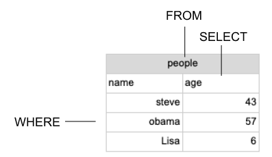
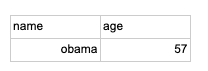
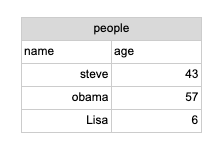
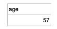

# Accessing Data

Unlike google sheets where everyone can get access to data with a simple click. Getting to run queries against a database requires getting permissions. Access is most commonly given out through a BI tool instead of credentials into the database itself.

Making this part of onboarding at your company will save numerous headaches. Otherwise you will receive random pings to get access all the time. The default should be to give people access and to help train them to use SQL so they can answer most of their data related questions.

## Asking a question

Once people have access they might need help understanding how to ask a question of the database. People are used to typing half thought out things into Google and getting a pretty satisfying answer. Unfortunately this is not currently possible within a company. Instead you have to write more specific questions to get the data you want.

Let’s start with an everyday life question that we type into Google.

What age is Obama?



Google can answer this without you even hitting enter on the keyboard. In companies we have to write out questions in SQL.

`SELECT age FROM people WHERE name = 'obama'`

We put the data that we want in the SELECT statement (age) and we put what table that data exists in, in the FROM statement (people). Lastly put conditions to find what matches our criteria in the WHERE statement (name=’obama’)



That SQL query on this example table would give us 57.

## Writing SQL for the first time

The easiest way to write SQL is to draw the table you wish you had to answer the question you have in your mind. Fill out the columns and put in some values that you might expect to get back



The columns you have written down will go in your SELECT statement.

`SELECT name, age`

The FROM part is a bit trickier, we have to specify what table it is from. It may not be obvious what the table is called so we will need to look at the schema to see what table contains the fields we want.



In this case we can see that the people table has both name and age so we can put the table name in the FROM statement.

```
SELECT name, age
FROM people
```

The WHERE clause needs to specify any specific about what records we want from this table. In this case we want the record where the name is equal to obama

```
SELECT name, age
FROM people
WHERE name = 'obama'
```

This would give us:


Lastly if we only want to see the age we can remove name from the SELECT statement and get the answer that Google would have provided.

```
SELECT age
FROM people
WHERE name = 'obama'
```



## Exploring tables

It might not always be easy to know if the data is in the table you are looking at by examining the schema. In which case you can run a query to show you all the fields and records for a table. Instead of having to type out every field name you can put an asterisk in the SELECT statement.

```
SELECT *
FROM people
```

This lets you see all the data in that table. If you are exploring the data to figure out what it contains we suggest limiting the amount of records you get back to improve the speed of the query. You do this in a LIMIT statement that comes at the end of the query and you specify the number of rows you want to see.

```
SELECT *
FROM people
LIMIT 2
```

### Summary


1. Access to a database needs to be provided to you by someone on the data or IT team
2. Asking a question of a company’s data is similar to googling a question but requires you to ask it in a very particular way
3. Writing out the table you wish you had is an easy way to help you write the query you want
4. Finding which tables the data you need is in can be challenging but using SELECT * and LIMIT you can quickly explore tables in a schema

