# How CASE WHEN Works

CASE WHEN takes in values, checks them against a condition and THEN outputs values into a new column based on if it satisfies the condition.

CASE WHEN in SQL operates very similarly to “if then” statements in other programming languages. Replace the “if” with CASE WHEN and “else if” with WHEN, and the rest matches:

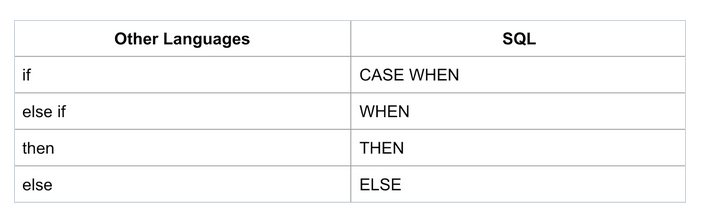

Note: CASE WHEN statements will always output new values to a new column which is different than “if then” which can replace values in the same column.

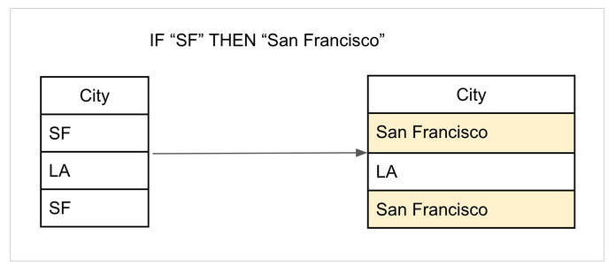

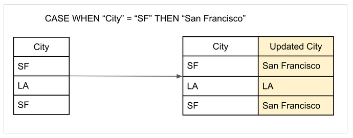

Now let’s see what the full query would have looked like for that CASE WHEN statement, notice the title of the output column at the end of the CASE WHEN statement.

```
SELECT City,
CASE WHEN City = "SF" THEN "San Francisco"
ELSE City
END AS "Updated City"  
FROM friends
```

Let’s break down each component of the CASE WHEN statement:


- CASE: indicates a condition loop has been started and that the conditions will follow.
- WHEN: indicates the start of a condition that should be checked by the query.
- THEN: executed when the condition is true, determines the output for the true condition.
  - After THEN is executed, CASE will return to the top of the loop and begin checking the next entry.
  - If the condition is false, the next WHEN statement will be evaluated.
- ELSE: catches all of the entries that were not true for any of the WHEN conditions.
- If no ELSE statement is present and all WHEN conditions are false, the returned value will be NULL.
- END: Indicates the end of the CASE loop.
- AS: Used to set a specific name for the returned CASE column.

> NOTE: If you put the column name after THEN or ELSE it will put the value from the original column into the newly created column. In the example we see this done with ELSE City which puts LA unchanged in the new column


## Syntax

```
SELECT (optional: any desired columns),
CASE WHEN (condition) THEN (desired output)
WHEN (other condition) THEN (desired output)
ELSE (desired output)
END AS (descriptive header for the output column)
FROM (appropriate table);
```

>Note: you do not have to show all of the columns, or any columns besides the CASE column in the output.


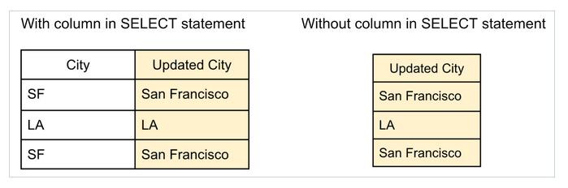

## CASE WHEN Issues

### Query Time

Time to complete a query can be a problem. There is no defined maximum for the number of WHEN conditions you can have within a CASE WHEN statement. CASE WHEN queries can become very slow because the query has to check each condition for every row until it finds a case where it satisfies the condition. This can dramatically increase the query time.

If queries are taking a long time to finish, consider finding ways to optimize your query.

### Data Types

Make sure that you are comparing the correct data types in your queries. If you try to compare incompatible types SQL will return an “Invalid Input Syntax” error.

#### Same Data Type

```
SELECT Track.Name, Track.GenreId,
CASE WHEN (Track.Name = '40') THEN 'Rock'
END AS Genre FROM Track
ORDER BY Track.Name ASC LIMIT 10;
```

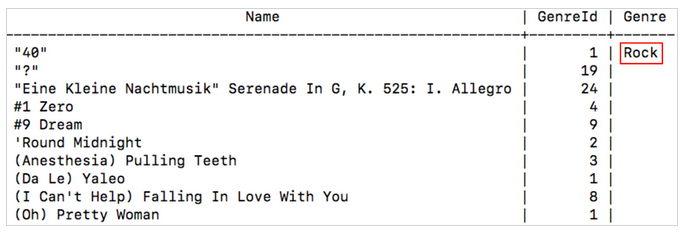

The Name field is a VARCHAR and we compare it to the characters “40”.

#### Different Data Type

```
SELECT Track.Name, Track.GenreId,
CASE WHEN (Track.Name = 40) THEN 'Rock'
END AS Genre FROM Track
ORDER BY Track.Name ASC LIMIT 10;
```

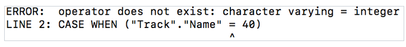

The Name field is a VARCHAR and cannot be compared to an INTEGER.

Remember you can cast any of your values in order to make the data types match. To determine what data type is used in a column you can use the “\d (Table name)” command and look for the “Type” column:

`\d "Track"`

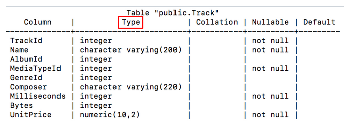

## In Depth Example

This example uses the Chinook database with PostgreSQL 11. The “Track” table in the Chinook database is a large, informational table on many different songs by many different artists.

The “TrackId” in the table below is unique for each entry. However, the “GenreId” column is a reference to another table that links each id number to a genre of music. Let’s say you lost the “Genre” table (indicated with the red X through it). Now you could not JOIN in Genre Names, How could we replace the GenreId in the Track table?

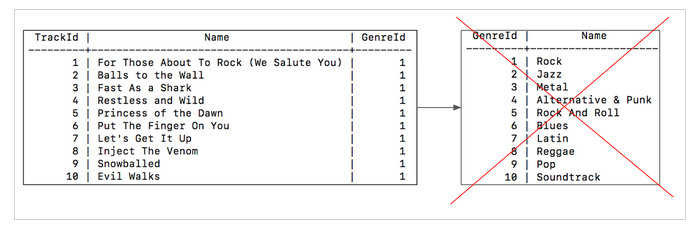

CASE WHEN allows you to assign the genres yourself. Looking at the first few songs, you can see they all have the same GenreId and we know that 1 corresponded to the “Rock” genre. We can use CASE WHEN to check if there is a 1 in the GenreId Column and then put “Rock” into a newly created GenreType column:

```
SELECT Track.Name, Track.GenreId,
CASE WHEN (Track.GenreId = 1) THEN 'Rock'
END AS 'GenreType'
FROM Track LIMIT 10;
```

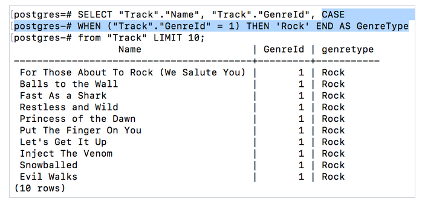


There are more than just 1 genre of music in the track table. Order the entries alphabetically to see some examples of songs that do not have a “GenreId” of 1. In the GenreType column null is returned for any values that did not satisfy the conditions of the CASE WHEN statement:

```
SELECT Track.Name, Track.GenreId,
CASE WHEN (Track.GenreId = 1) THEN 'Rock'
END AS 'GenreType'
FROM Track
ORDER BY Track.Name ASC
LIMIT 10;
```

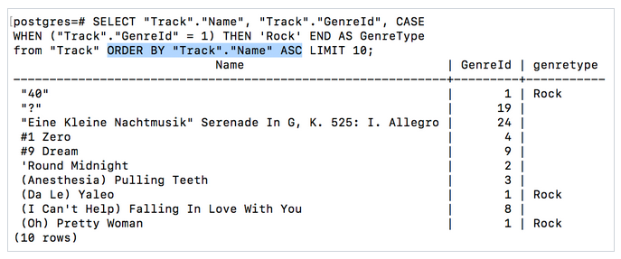

Note: Null values are sometimes not printed in the output, other times they will be greyed out or italicized like this Null

All of the null entries in GenreType column are not “Rock” songs, so you can use CASE WHEN to label them as “Not Rock”. This can be done using the ELSE keyword:

```
SELECT Track.Name, Track.GenreId,
CASE WHEN (Track.GenreId = 1) THEN 'Rock'
ELSE 'Not Rock'
END AS 'GenreType'
FROM Track LIMIT 10;
```

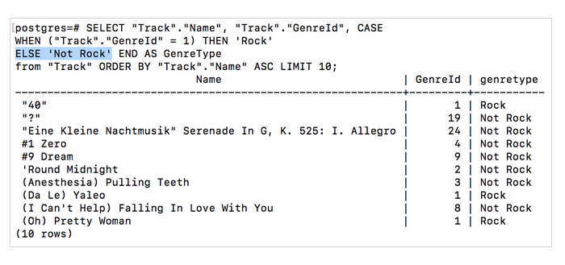


Alternatively the WHEN keyword can be used several times to create multiple conditions:

```
SELECT Track.Name, Track.GenreId,
CASE WHEN (Track.GenreId = 1) THEN 'Rock'
WHEN (Track.GenreId = 2) THEN 'Jazz'
WHEN (Track.GenreId = 3) THEN 'Metal'
WHEN (Track.GenreId = 4) THEN 'Alternative & Punk'
ELSE 'Unknown'
END AS 'GenreType'
FROM Track LIMIT 10;
```

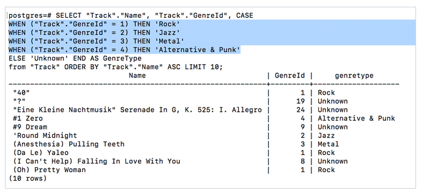

## Summary:


1. CASE WHEN is used to determine conditional statements in SQL
   1. CASE declares the start of the conditions
   2. WHEN declares a condition
   3. THEN declares the return of a true condition
   4. ELSE catches any entries that do not trigger a conditional check
   5. END declares the end of the CASE checks
2. You can have a multitude of WHEN statements
3. AS can be used to create a header for the return data, otherwise it is given the header “case”
