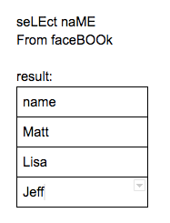

# Syntax Errors

When writing SQL queries there are many places where a small mistype can cause you to receive an error. We will review some of the most common errors due to syntax mistakes. Note: this article will cover how common syntax errors affect Postgresql, if you are using a different type of SQL please check the documentation for these scenarios.

## Spelling

Misspellings are the most common cause for error in SQL. Unfortunately, SQL will not autocorrect mistyped keywords, tables, columns, or values.

1. Check keyword spelling by referring to the documentation for the type of SQL you are using.
2. Check table spelling by referring to the database schema.
3. Check column spelling by referring to the database schema or doing SELECT * FROM the table you are trying to check the column name on. **NOTE:** putting limit 1 on that query will make it run quickly.
4. Check value spelling by doing SELECT * FROM table GROUP BY the column where the value is in. Then look through this column to find the value you were trying to match.

## Single vs. double quotes

A very common, yet not so obvious syntax error you can make is to use the wrong type of quotation marks in your query. This can change the meaning of what you are referencing inside the quotes.

Examine the following two examples:

Single quotes indicate you are referencing that text string


Double quotes indicate you are referencing a table name or a field.


Different types of SQL handle a single quote ‘ and a double quote “ differently so if you get an error such as “ERROR: column “age” does not exist,” try switching to using the other type of quotation around the text and if that does not work consult the documentation for that specific type of SQL.

## Capitalization

If you reference a column or table and put it in quotes and the capitalization does not match what it is in the database, you will get an error since that table or column does not exist in the database. If you do not use quotes to reference the column or table it will run as expected.


For the table above the keyword select, the table facebook, and the column name without quotes can be written as:


You can get the same result with whatever use of upper and lower case letter:



Table and column with quotes must be written lowercase since that is how they are in the table above:


There are some capitalization conventions that should be followed though they are not required. The main one being that the keywords for clauses should be written out in all caps. This helps with the readability of the query.

While this capitalization of Select and From will work:


This is all capitalization of SELECT and FROM is preferred:


## Data Types

A common syntax error is not using the correct data type when comparing a value in a field with some constant in your query. Sometimes when a number is stored in a database it is stored as a string. This would cause the following query to error.


The query below will produce an error because the data type of 27 in the WHERE clause is numeric but the field age is a text data type:


To get the answer we expect we must put 27 in single quotes ‘27’


## Clause Order

When writing a SQL query you have to place the clauses you use in this order.

1. SELECT
2. FROM
3. JOIN
4. WHERE
5. GROUP BY
6. HAVING
7. ORDER BY
8. LIMIT

You do not need to include all of these clauses in a SQL query but you do need at least the first two. The most common mistake is placing the HAVING clause ahead of the GROUP BY clause. Or placing the WHERE clause after the GROUP BY.

WHERE filters rows before they are grouped.


HAVING filters the newly grouped rows.


## 0 Rows Returned

Getting an error in SQL can be frustrating. However getting no errors and no data returned by your query can be even more frustrating. In this tutorial we will explore the most common reasons your query will return 0 rows of data.

### JOINing on the wrong column

The most common issue is JOINing on the wrong column. In the example below it is JOINing on the name column in both tables, however in the pets table the column that would have corresponded to the facebook friend table would have been owner.


Sometimes you have picked the right column but there are no matches in the corresponding data. In this example the names of the owner have been changed to show this scenario.


Another thing to watch out for which will return an error is if the datatype of the columns being joined do not match. Sometimes columns with numbers in it are saved as text. You will have to CAST that column as a numeric data type such as INT or FLOAT. You could also convert the numeric column to a text data type such as VARCHAR.

It is a best practice to inspect the tables you will be joining independently to try and find these issues. Do a SELECT * from each of the tables (with a LIMIT 10) to review the data and data types in the columns you are trying to JOIN on.

### Over Filtering

The second most common issue that produces 0 rows returned is that the query is filtering out too much data in the WHERE or HAVING statement.


To see if the WHERE or HAVING clause is too restrictive simply remove it from the query to see if any rows are returned. If rows are returned the problem is likely in your WHERE or HAVING clause.

## How to debug an SQL query

Whenever you get a result you do not expect in SQL take a second and break down the query into smaller bits. Remove or comment clauses out one by one to find where the query stopped making sense. To comment out a part of you SQL query review the documentation for the syntax. In PostgreSQL all you do is add two dashes in front of a line of SQL

```
SELECT *
FROM facebook
--WHERE # of Friends > 1000
```

This concept of breaking queries into small pieces also works when you are initially creating the query. Start with a query that only contains SELECT, FROM, and LIMIT. Then layer on each additional SQL clause 1 at a time and run it to see if there are any issues. While this practice is slow you are much less likely to run into an issue in your query that you don’t know the cause of.


## Summary

Be careful when writing a SQL query. If you get an error first check for these common syntax errors before delving more deeply into what might be the cause.

1. Spelling errors
2. Single vs Double quotes
3. Capitalization
4. Data Types
5. Clause Order
6. 0 Rows Returned
   1. Check if you are joining on the wrong column
   2. Check if you are over filtering the data
   3. Use a double dash – to comment out parts of the query to see what part is causing the issue


