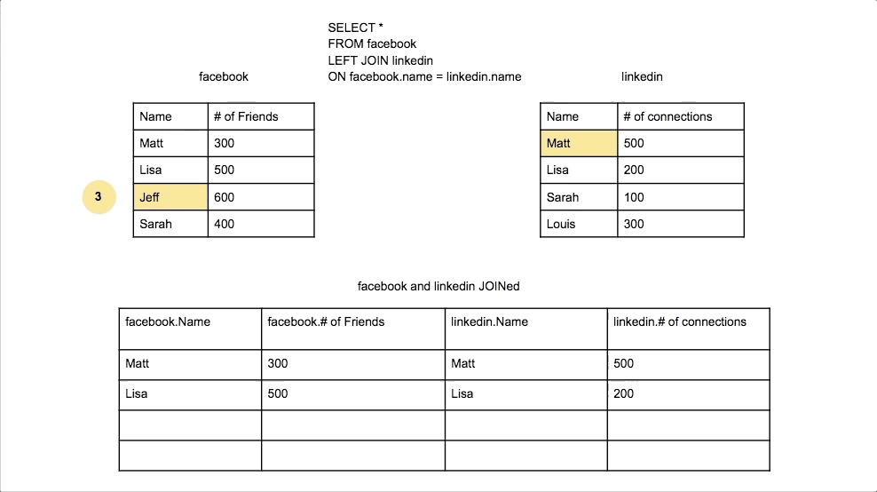
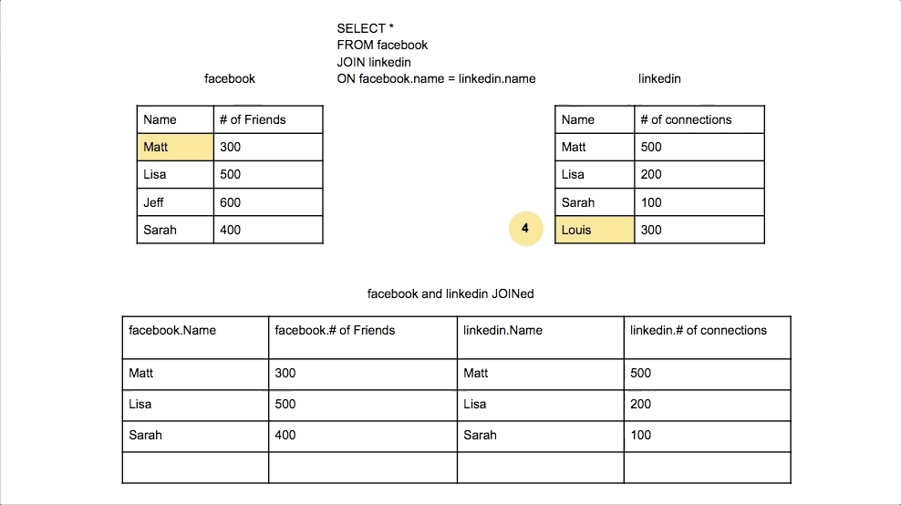

# SQL Join Types Explained Visually

Merging two data sets using SQL or SQL tools can be accomplished through JOINS. A JOIN is a SQL instruction in the FROM clause of your query that is used to identify the tables you are querying and how they should be combined.

## Primary and Foreign Keys

Typically in a relational database, data is organized into various tables made of attributes (columns) and records (rows). In each table there exist a column that is the primary key which is a column where each entry uniquely represents a single row in that table. This is usually the ID (short for identifier) column. A column in a table that establishes an association with another table’s primary key via shared values is called a foreign key. Foreign keys are also typically titled IDs but prepended with the name of the referenced table.

This concept is applied when combining two or more tables together using a JOIN. In the example below, we have two tables: User Table (Table 1) and Event Table (Table 2). We want to join the two tables together to get user data alongside their events data. A real-life example of this would be if you had data from a CRM tool like Salesforce containing users who are paid customers (Table 1) and an events analytics tool like Mixpanel that tracks all the users that have performed an action in your product (Table 2).


Notice that between the two tables there is a common column (dimension) highlighted in green, User ID. In the User Table, the ID column is the user ID and it’s the primary key for that table whereas, in the Event Table, the User_ID column is the foreign key since that column refers to the ID column in the Users table. We can use this relationship to join the two tables together to get the user and events information in one table.

## Meet the joins

There are three common ways you can join any two or more tables together we’ll talk about first: Outer Join, Inner Join, and Left Join. Using the example User and Event tables above, let’s look at some examples of joins…

### Inner Join

What if you want to have a table that contains only users that have done an action?

You would use an Inner Join to join the tables together. An inner join combines the columns on a common dimension (the first N columns) when possible, and only includes data for the columns that share the same values in the common N column(s). In the example, the User ID would be the common dimension used for the inner join.


This is the default type of JOIN in SQL, in fact you do not even need to specify INNER JOIN when writing a query. Only writing JOIN is an INNER JOIN.

```
SELECT *
FROM facebook
JOIN linkedin
ON facebook.name = linkedin.name
```

SQL first creates a new table with the columns of both of the tables you are trying to combine.


It then tries to find values that match between the columns you specify in the ON statement. Putting the table name with a period before the column name makes it clear which two columns of the tables SQL will be looking for matches between.

`ON facebook.name = linkedin.name`


SQL then starts with the first value of the specified column in the first table (facebook.name) and then looks through every value in the specified column of the second table (linkedin.name) for a match.


If there is a match it copies the data from both the row of the first table and the row of the second table and puts it into the newly created table. SQL will not add in any rows that did not have a match.


Be sure to know what data you want in the final table so that the data left out does not affect your analysis.

Another thing to consider is that SQL will join the rows every time there is a match. So if your data in the columns you are joining on are not unique you will get duplicate data in the final table.

Non Unique data in Second table:


Non Unique data in First table:


As we can see the non unique data pulls in the same value from the other table twice. This is a common situation that can cause you to double count data if you are not aware that this is happening.

### Left Join

Now, what if you want to have a table that contains all the users’ data and only actions that those users have done? Actions performed by other users not in the users table should not be included?

You would use a Left Join to join the tables together. A left join combines the columns on a common dimension (the first N columns) when possible, returning all rows from the first table with the matching rows in the consecutive tables. The result is NULL in the consecutive tables when there is no match. In this case, we would make the User Table the first (left table) to use for the left join.


This is the second most common type of JOIN in SQL. Left refers to the first table, or the table you will be joining to. So in this case it would be the facebook table since it comes before linkedin table in the query.

```
SELECT *
FROM facebook
LEFT JOIN linkedin
ON facebook.name = linkedin.name
```

This query finds matches and adds them to a newly created table in the same way as an INNER JOIN.


However there is a large difference in how SQL treats the LEFT table (first table; in this case the facebook table). For any rows in the first (or LEFT) table that did not have a match, it will still add this row to the new table and put in nulls for the columns from the other table.



#### Right Join

This is one of the rarest types of JOIN in SQL. The reason for this is that any RIGHT JOIN can be re-written as a LEFT JOIN, which is more conventional. Right refers to the second table, or the table you will be joining in. So in this case it would be the linkedin table since it comes after facebook table in the query.

```
SELECT *
FROM facebook
RIGHT JOIN linkedin
ON facebook.name = linkedin.name
```

So this could be re-written as a LEFT JOIN and produce the same results:

```
SELECT *
FROM facebook
LEFT JOIN linkedin
ON facebook.name = linkedin.name
```

However let’s look at the process of a RIGHT JOIN in order to see how it works. It changes which table SQL evaluates from.


Here we can RIGHT JOIN similar to the LEFT JOIN bring in rows from the RIGHT (or second) table that did not have any matches and add nulls for the columns in the first table.




### Outer Join

Let’s say you want to have a table that contains all your user and event table data together.

You would use an Outer Join to join the tables together. An outer join combines the columns from all tables on one or more common dimension when possible, and includes all data from all tables.


This is the third most common type of JOIN in SQL. FULL OUTER refers to the first table, or the table you will be joining to. So in this case it would be the facebook table since it comes before linkedin table in the query.

```
SELECT *
FROM facebook
FULL OUTER JOIN linkedin
ON facebook.name = linkedin.name
```

This query finds matches and adds them to a newly created table in the same way as a LEFT join.


However after completing the LEFT join of the data then there is essentially RIGHT join performed. However since all the cases where there is a match has been made, SQL only checks to see if each value is present in the joined table. If it is not in the joined table, SQL will add this row to the new table and put in nulls for the columns from the other table.


### Union and Cross Join

In addition to these common join types, there are some methods which will result in additional rows in your output table as well as more columns. Two of these join types are called Union and Cross Join. These join types probably wouldn’t be as appropriate for our example tables above, but for the sake of this article we can still use them to see how these joins function. A Union Join will stack tables on top of each other resulting in new rows.


A good use case for this would be if you’re looking to combine two tables by appending them rather than joining them. 

This is the fourth most common type of JOIN in SQL. Union does not attach the data from two tables to a single row. Union stacks two data sets on top of each other into a single table.

```
SELECT *
FROM facebook
UNION ALL
SELECT *
FROM linkedin
```

There are a few considerations you must make before performing a UNION. The number and order of columns and for both tables must be the same. The data types of the columns that are being combined must have the same data type. You can specify which column(s) you want to union, and in this example we will select only the Name column from both tables which are both text and so they can be unioned.

```
SELECT Name
FROM facebook
UNION ALL
SELECT Name
FROM linkedin
```


However if the columns selected do not have the same data type such as trying to Union the Name column of the facebook table and the # of connections column from the linkedin table.

```
SELECT Name
FROM facebook
UNION ALL
SELECT # of connections
FROM linkedin
```

This will trigger an error.

We would also get this error even if we have both columns selected from the tables but in different order

```
SELECT Name, # of friends
FROM facebook
UNION ALL
SELECT # of connections, Name
FROM linkedin
```

However if we put the columns we are selecting in order, then it will run the same as our first example query since this is the order the columns are in in their respective tables.

```
SELECT Name, # of friends
FROM facebook
UNION ALL
SELECT Name, # of connections
FROM linkedin
```


A Cross Join would result in a table with all possible combinations of your tables’ rows together. This can result in enormous tables and should be used with caution.


Cross Joins will likely only be used when your tables contain single values that you want to join together without a common dimension.

This is the fifth most common type of JOIN in SQL. Cross join does not look for matches between any values in the two data sets. Instead for each row in first table every row of second table will be attached to it and added to the final table one by one.

```
SELECT *
FROM facebook
CROSS JOIN linkedin
```


Why use a CROSS JOIN vs a UNION, LEFT JOIN, RIGHT JOIN, INNER JOIN, FULL OUTER JOIN? To help understand, Let’s think about the different questions they are asking.

1. CROSS JOIN: How many combinations of friends and connections do I have?
2. UNION: How many friends do my Facebook friends have and how many connections do my LinkedIn connections have?
3. LEFT join: How many friends and connections do my Facebook friends have? (Regardless of if they are on LinkedIn)
4. RIGHT join: How many friends and connections do my LinkedIn connections have? (Regardless of if they are on facebook)
5. INNER join: How many friends and connections do my friends who are on both on Facebook and LinkedIn have?
6. FULL OUTER join: How many friends and connections do my Facebook friends or LinkedIn connections have?


## Summary cheat sheet


