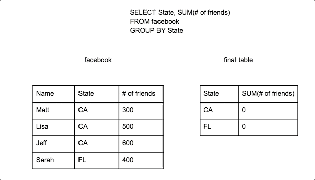
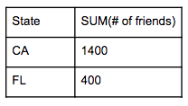
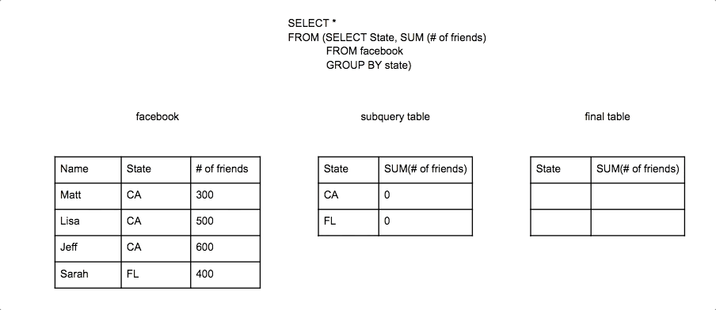
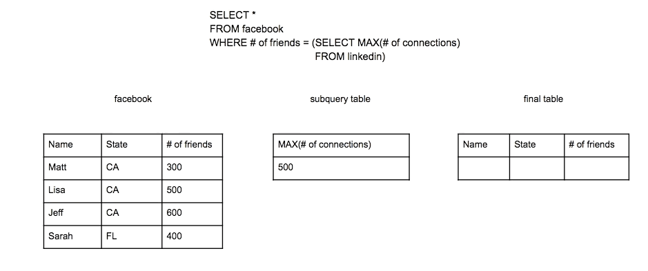
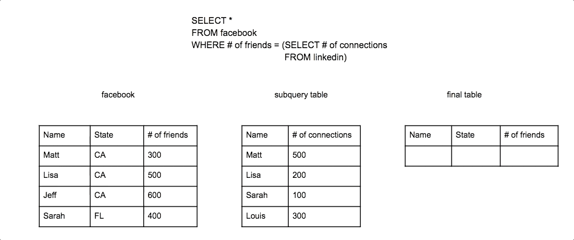
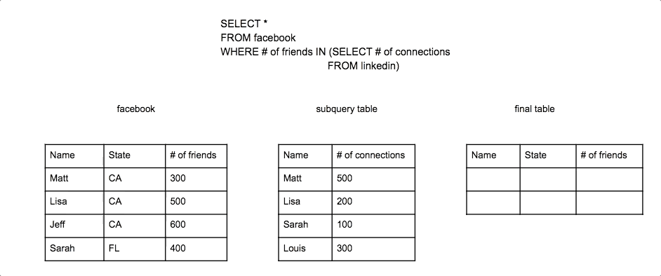
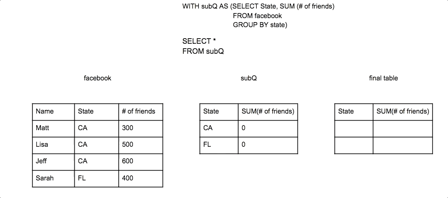

# How Subqueries Work

A SQL subquery can look complicated:

```
SELECT *
FROM (SELECT State, SUM (# of friends)
	FROM facebook
	GROUP BY state);
```

The core concept to grasp is that the subquery (the part inside the parentheses) is a separate SQL query that produces a table that is then used in the main query.

Let’s break the example above up and do the subquery first by itself.

Subquery:

```
SELECT State, SUM (# of friends)
FROM facebook
GROUP BY state;
```



This subquery produces a table:



This table from the subquery can then be used by the main query.

Main query:

```
SELECT *
FROM (subquery table)
```

Now while this was a somewhat pointless subquery example since you could have just run the subquery to get the same result, it illustrates the point the the outer query is pulling from the created table of the subquery. In this case it is selecting everything from the subquery.



## Subquery placement

Subqueries are most commonly in the FROM statement as a table to query from. However a subquery can also be placed in the WHERE or HAVING statement. When using it in the WHERE or HAVING statement, the subquery has to produce a single value table if you are using comparison operators such as =, <, <=, >, >=, !=.

Single value subquery table:

```
SELECT *
FROM facebook
WHERE # of friends = (SELECT MAX(# of connections)
	FROM linkedin)
```





Multi-value subquery tables will result in an error since it would try to compare a single field to every row in a column or every cell within table at once.

```
SELECT *
FROM facebook
WHERE # of friends = (SELECT # of connections
	FROM linkedin)
```




Multi-value subquery tables can be used with logical operators such as IN which compares a single field to every row in a column or table.

```
SELECT *
FROM facebook
WHERE # of friends IN (SELECT # of connections
	FROM linkedin)
```




## Common table expression

Subqueries can also be written in a WITH statement instead of in the main query. You write WITH and then what you want to name the resulting table from the subquery and then in parentheses write the subquery. Then you can write a query that uses that subquery by referring to the name given to it. When written in this way they are referred to as a common table expression (CTE). Look at the original example and re-written version using a WITH statement below.

Subquery in the Query:

```
SELECT *
FROM (SELECT State, SUM (# of friends)
	FROM facebook
    GROUP BY state)
```

Subquery in a WITH statement:

```
WITH subQ AS (
	SELECT State, SUM (# of friends)
	FROM facebook
	GROUP BY state)
SELECT *
FROM subQ
```

Writing it this way can help make it more clear that you are first creating a table and then referencing it in the outer query.



